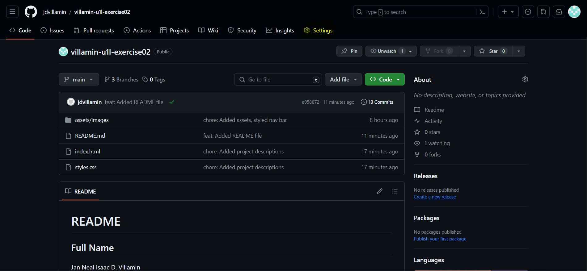
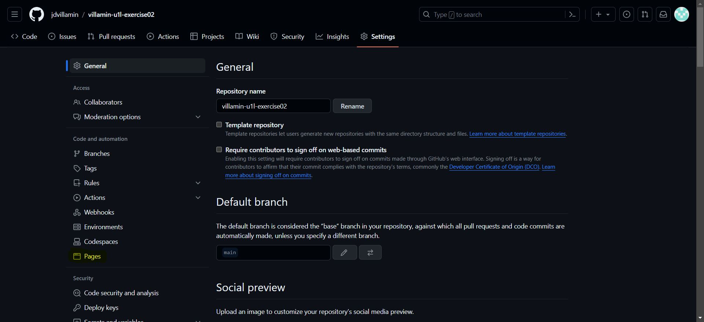
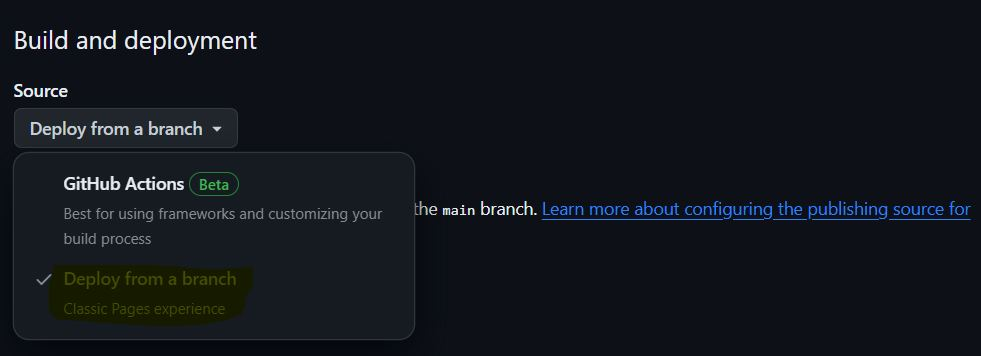
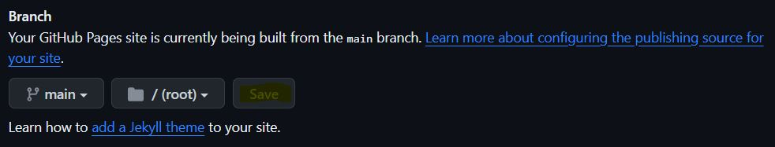
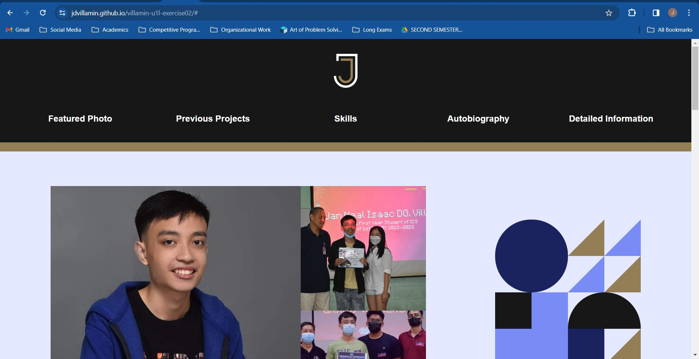

# README

## Full Name
Jan Neal Isaac D. Villamin

## Degree Program
Computer Science

## Live Website Link
https://jdvillamin.github.io/villamin-u1l-exercise02

## Steps on how to create GitHub page
### Step 1:
Make sure that your repository is completely pushed in the remote repository.

### Step 2:
Navigate to the Settings tab.

### Step 3:
Navigate to the Pages option.

### Step 4:
Under Build and deployment, select Github Actions, then Deploy from a branch.

### Step 5:
Under Branch, select the /root folder then Save.

### Step 6:
It may take a few minutes, go to your Github.io page by the URL
"<Github username>.github.io/<repository name>"

## Key takeaways from the exercise
Here are some of my key takeaways:
1. It is better to create a design first using Canva, Slides, or similar so that you can just focus on implementation while coding rather than thinking about the design as well.
2. Make sure to wrap your HTML tags with necessary divs to adjust alignment and styling for CSS, even if at first it seems not necessary for just the HTML layout.
3. Always commit significant progress for multiple reasons:
  - If you want to go back at some point.
  - It serves as a checkpoint for your progress so that it doesn't make you lost and feel burnout.
4. Create branches for testing layouts and designs.
5. Using HTML and CSS to implement your website from scratch takes a lot of work. In short, it it **tedious**. The focus seemed to be on very minimal details rather than the features of the webpage. Hence, we might need faster ways such as using React.JS.